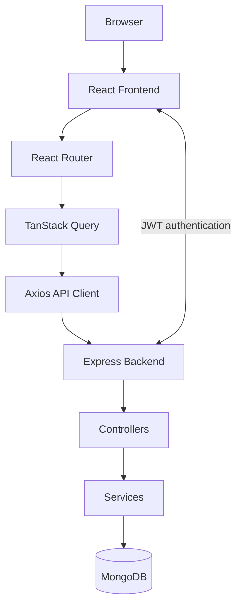

# Car Dealership Inventory System


A full-stack inventory application for car dealerships. It provides authenticated vehicle management, a dashboard with inventory insights, and a documented REST API backed by MongoDB.

## Live Demo

| Service  | URL              |
| -------- | ---------------- |
| Frontend | `<FRONTEND_URL>` |
| Backend  | `<BACKEND_URL>`  |
| API Docs | `<API_DOCS_URL>` |

## Features

### Authentication

- JWT-based registration and sign-in
- Protected routes, public-only routes, and session restoration
- Automatic sign-out after unauthorized API responses

### Inventory Management

- Create, edit, and delete vehicles
- Confirmation before deletion
- Client-side sorting and pagination
- Optimistic deletion with automatic rollback on failure

### Dashboard

- Inventory totals, availability, sales, and average-price statistics
- Status distribution chart
- Loading skeletons and empty-state handling

### Search, Filtering, and Export

- Debounced brand and model search
- Status filtering
- CSV export for the current inventory result set

### Keyboard Shortcuts

- Focus search, clear search, export CSV, add a vehicle, and open the shortcut reference
- Keyboard-accessible dialogs with focus trapping and focus restoration

### Accessibility

- Labelled forms, required-field semantics, validation announcements, and invalid-field state
- Semantic tables, descriptive row actions, accessible pagination, and live loading/error feedback
- Modal dialog semantics with Escape handling and managed focus

### Performance

- Route-level lazy loading
- TanStack Query caching, invalidation, prefetching, and optimistic updates
- Cached dashboard and inventory data with reusable query and mutation hooks

### Testing

- Vitest and React Testing Library coverage for reusable UI components
- User-focused tests for alerts, loading states, dialogs, focus management, and keyboard interaction

### Developer Experience

- TypeScript across frontend and backend
- ESLint, Prettier, Husky, and lint-staged
- GitHub Actions CI for frontend and backend checks

## Tech Stack

| Area              | Technology                                               |
| ----------------- | -------------------------------------------------------- |
| Frontend          | React, TypeScript, Vite, React Router, Axios, Recharts   |
| Backend           | Node.js, Express, TypeScript                             |
| Database          | MongoDB, Mongoose                                        |
| State Management  | TanStack Query and React Context                         |
| Testing           | Vitest, React Testing Library, jest-dom, Jest, Supertest |
| CI/CD             | GitHub Actions                                           |
| Developer Tooling | ESLint, Prettier, Husky, lint-staged                     |

## Architecture

## Architecture Diagram



### Frontend

The Vite application is organized around route pages and reusable components. Route pages coordinate user interactions, while shared components provide forms, tables, charts, dialogs, feedback states, and layout primitives.

### Backend

The Express API separates routes, controllers, models, middleware, configuration, and services. MongoDB persistence is handled through Mongoose, and authenticated endpoints use JWT middleware.

### API Layer

The frontend Axios client centralizes the API base URL, JSON headers, authentication headers, timeouts, and unauthorized-response handling. Focused service functions expose authentication and inventory requests to hooks and pages.

### React Query

TanStack Query owns server state for inventory and dashboard data. Query hooks provide data access, mutation hooks handle cache invalidation and optimistic deletion, and prefetch hooks prepare dashboard and vehicle data before navigation.

### Custom Hooks

Reusable hooks group query, mutation, prefetch, debounce, and keyboard-shortcut behavior. This keeps pages focused on presentation and feature flow.

### Context Providers

`AuthContext`, `ToastContext`, and `LoadingContext` provide cross-cutting client state for authentication, notifications, and the global loading overlay.

### Component Organization

Components are grouped by responsibility: reusable UI primitives, forms, charts, feature components, and page-level views. Accessibility behavior is implemented alongside the relevant reusable component.

## Folder Structure

```text
car-dealership-inventory-system/
├── .github/
│   └── workflows/             # Continuous integration workflow
├── backend/
│   ├── src/
│   │   ├── config/            # Database and Swagger configuration
│   │   ├── controllers/       # Request handlers
│   │   ├── middleware/        # Authentication and error middleware
│   │   ├── models/            # Mongoose models
│   │   ├── routes/            # API route definitions
│   │   ├── services/          # Backend services
│   │   └── tests/             # Jest and Supertest tests
│   └── package.json
├── frontend/
│   ├── src/
│   │   ├── components/        # UI, forms, charts, and feature components
│   │   ├── context/           # Auth, loading, and toast providers
│   │   ├── hooks/             # Query, mutation, prefetch, and utility hooks
│   │   ├── lib/               # Shared QueryClient configuration
│   │   ├── pages/             # Route pages
│   │   ├── services/          # Axios client and API services
│   │   ├── test/              # Vitest setup
│   │   └── utils/             # Shared utility functions
│   └── package.json
├── .env.example
└── README.md
```

## Screenshots

### Login


### Dashboard


### Inventory


### Add Car


### Edit Car


## Installation

### Prerequisites

- Node.js and npm
- A local MongoDB instance or a MongoDB connection string

### Backend

```bash
cd backend
npm install
```

Create a backend environment file or configure these variables in your environment:

```env
PORT=5000
MONGO_URI=mongodb://localhost:27017/car-dealership-inventory
JWT_SECRET=replace_with_a_secure_secret
```

Start the API:

```bash
npm run dev
```

The local API runs on port `5000` by default. Swagger UI is available at `http://localhost:5000/api-docs/`.

### Frontend

In another terminal:

```bash
cd frontend
npm install
```

Create `frontend/.env`:

```env
VITE_API_URL=http://localhost:5000
```

Start the Vite development server:

```bash
npm run dev
```

## Environment Variables

| Location | Variable       | Description                              |
| -------- | -------------- | ---------------------------------------- |
| Backend  | `PORT`         | Express server port. Defaults to `5000`. |
| Backend  | `MONGO_URI`    | MongoDB connection string.               |
| Backend  | `JWT_SECRET`   | Secret used to sign and verify JWTs.     |
| Frontend | `VITE_API_URL` | Base URL for the backend API.            |

Do not commit environment files containing credentials.

## Available Scripts

### Frontend

Run from `frontend/`.

| Command                 | Description                               |
| ----------------------- | ----------------------------------------- |
| `npm run dev`           | Start the Vite development server.        |
| `npm run build`         | Type-check and create a production build. |
| `npm run lint`          | Run ESLint.                               |
| `npm run lint:fix`      | Run ESLint with fixes.                    |
| `npm run format`        | Format files with Prettier.               |
| `npm run format:check`  | Check Prettier formatting.                |
| `npm run test`          | Run the Vitest suite once.                |
| `npm run test:watch`    | Run Vitest in watch mode.                 |
| `npm run test:coverage` | Run Vitest with V8 coverage.              |

### Backend

Run from `backend/`.

| Command         | Description                             |
| --------------- | --------------------------------------- |
| `npm run dev`   | Start the API with nodemon and ts-node. |
| `npm run build` | Compile TypeScript to `dist/`.          |
| `npm start`     | Run the compiled server.                |
| `npm test`      | Run the Jest suite.                     |

## Testing

The frontend uses Vitest with React Testing Library and jest-dom in a shared jsdom setup. Reusable component coverage includes status feedback, statistic cards, error fallback behavior, loading overlays, and keyboard shortcut dialog behavior. Tests emphasize accessible queries and user interaction.

The backend uses Jest and Supertest for API-level testing.

## Accessibility

The application uses semantic landmarks, labelled page sections, native labels for form controls, `required` and `aria-invalid` states, and linked validation messages. Loading, errors, and asynchronous form submission states are exposed with appropriate `aria-busy`, status, and alert semantics. Dialogs include modal semantics, focus trapping, Escape support, logical initial focus, and focus restoration. Inventory table rows and action controls have descriptive accessible names.

## Performance Optimizations

- React Query caches inventory and dashboard server state with production-oriented stale and garbage-collection times.
- Dashboard data and individual vehicle details are prefetched ahead of likely navigation.
- Vehicle deletion uses optimistic cache updates with rollback on failure.
- Query invalidation keeps inventory and dashboard views synchronized after mutations.
- Debounced search reduces unnecessary filtering work while users type.
- Route-level lazy loading defers page code until it is needed.

## CI/CD

GitHub Actions runs on pushes and pull requests targeting `main`. Frontend and backend jobs run in parallel, use npm caching, install locked dependencies with `npm ci`, and execute available quality checks. The frontend job runs linting, tests, and a production build; the backend job detects and runs its build and test scripts.

## Future Improvements

- Role-based authorization
- Vehicle image uploads
- Server-side pagination and filtering
- Dark mode
- Docker-based local and production deployment
- Refresh-token rotation
- Deployment environments and release automation

## Resume Summary

Built a full-stack car dealership inventory system with React, TypeScript, Express, MongoDB, JWT authentication, TanStack Query server-state management, accessible reusable components, automated testing, and GitHub Actions CI.

## License

This project is licensed under the [MIT License](LICENSE).
